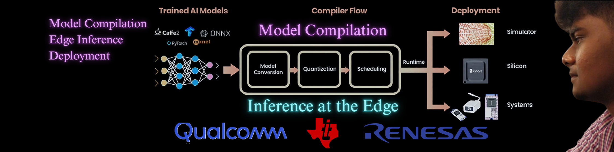

<picture>
  
</picture>

# Prithiveen Kumaar Ramkumar

**Builder of on-device AI systems**

> Product development graduate student at Northeastern University, College of Engineering (GPA 3.75/4.0). I take trained models and make them run on constrained silicon — quantization, network conversion, and runtime tuning across Qualcomm, Texas Instruments, and Renesas platforms.

---

## Experience and Projects

### Embedded AI deployment - `Qualcomm` · `Texas Instruments` · `Renesas`

Quantized multi-task AI models and performed network conversion for embedded targets using QNN, TIDL, RCAR and holding accuracy against performance benchmarks while improving inference runtime by 30% at Valeo for autonomous driving solutions.

`quantization` `network conversion` `multi-task models` `benchmarking`

### [On-device AI agent](https://github.com/PrithiveenKumaarRamkumar/WildAI) - offline chatbot Hackathon

Offline chatbot application built for on-device deployment, running the LiquidAI LFM2.5 230M model on a llama inference runtime. No network, no server — the model runs where the user is.

`on-device LLM` `llama runtime` `offline-first`

### [Agentic Notifier System](https://github.com/PrithiveenKumaarRamkumar/Agentic-Notifier-System) - creator

Attention-aware notifier for terminal-based AI agent workflows — routes to the TUI when the user is still in the terminal, to the GUI when they've left for the desktop. Proposal and UX design for human-in-the-loop agent interruption.

`agentic systems` `human-in-the-loop` `developer UX`

### [LoRA finetuning platform](https://github.com/PrithiveenKumaarRamkumar/CustomLLMFineTuning) - contributor

Dataset sanity pipeline for a custom coding-finetuning platform, plus a visual learning interface that makes LoRA's mechanics legible while training.

`LoRA` `QLoRA` `dataset validation` `training visualization`

### [MermaidNotes](https://visual-note-gen.lovable.app/) - deterministic mindmaps

Client-side visualization pipeline that turns textual scientific summaries into deterministic, human-readable mindmaps. Builds from a reference URL, a document, or raw text input.

`frontend` `visualization` `deterministic rendering`

---

## Product & leadership

- **TheSkidoo** - Product manager for a travel itinerary planning product. Laid the initial roadmap and ran two teams of early-talent developers and blog content writers against a core customer segment and consumer acquisition.
- **Jewelry storage unit** - Led a team of 4 through successive design iterations and customer interviews to a working prototype, with a BOM built for industrial scaling.

---

## Direction

- Models that ship to silicon, not just to a benchmark table
- Quantization and conversion pipelines that hold accuracy while cutting latency
- Offline-first AI agents that run entirely on the device in front of you
- Interfaces that make model internals legible to the people tuning them

---

## Operating range

`Embedded AI` `Edge inference` `Model quantization` `Network conversion` `On-device LLMs` `LoRA finetuning` `Agentic systems` `Vision tasks` `Product development`

---

> **Currently** seeking full-time opportunities building intelligent embedded AI systems, with a focus on edge inference.

[Portfolio](https://prithiveenkumaarramkumar.github.io/Portfolio/) · [LinkedIn](https://www.linkedin.com/in/prithiveen-kumaar) · [Email](mailto:ramkumar.pri@northeastern.edu)
